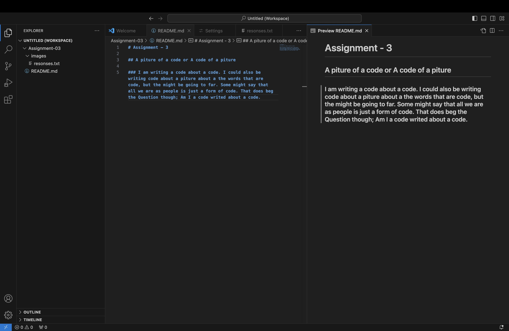

# Assignment - 3 

## A picture of a code or A code of a picture 

### I am writing a code about a code. I could also be writing code about a piture about a the words that are code, but the might be going to far. Some might say that all we are as people is just a form of code. That does beg the Question though; Am I a code writed about a code. 

[sep. 15](https://www.google.com/)

[My File](./responses.tet)

